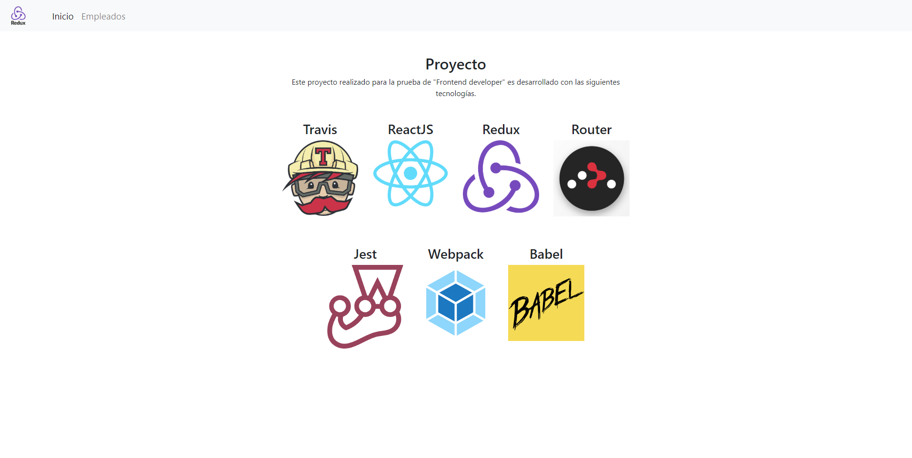
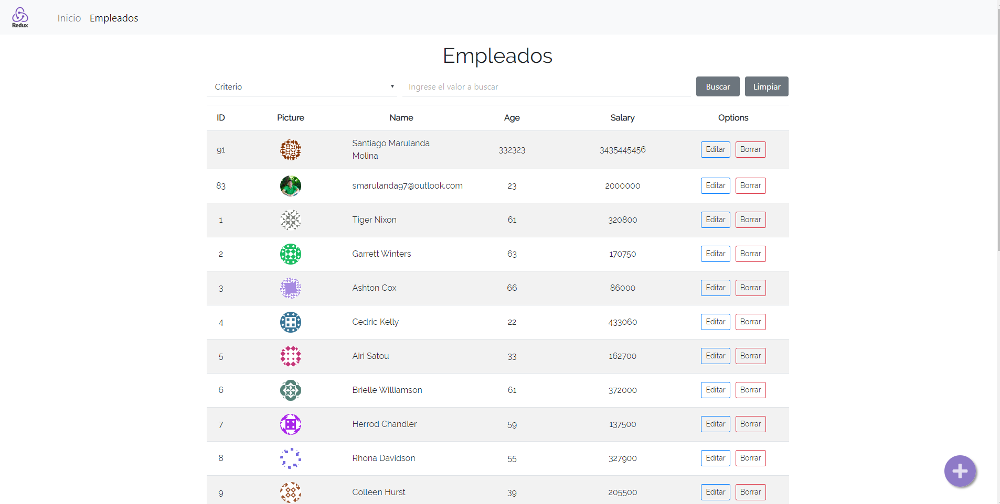

# FRONTEND DEVELOPER

Prueba técnica Frontend Developer.

## Importante
Puedes encontrar este proyecto en GitHub Pages
[Ir al proyecto](https://sanmm1997.github.io/fronted-developer-test/)

###Instruciones de instalación

1. Clonar el repositorio
2. Moverse hasta la carpeta y ejecutar "yarn install && yarn start"
3. Para build de producción ejecutar "yarn build:dll && yarn build"

### Home

### Empleados
